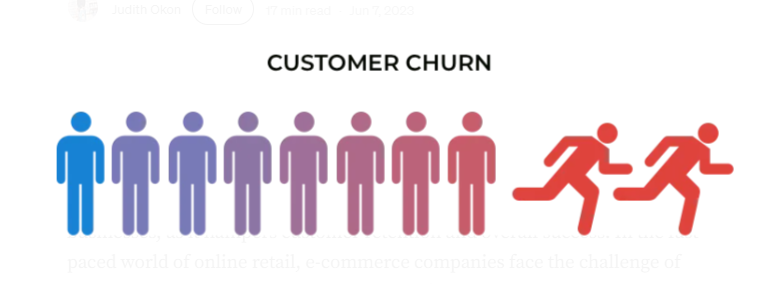
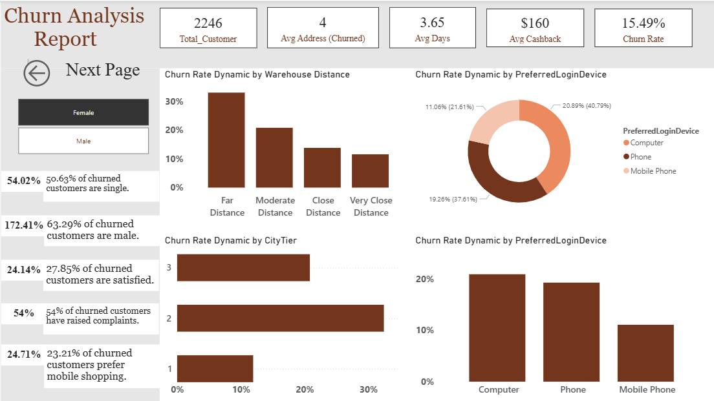
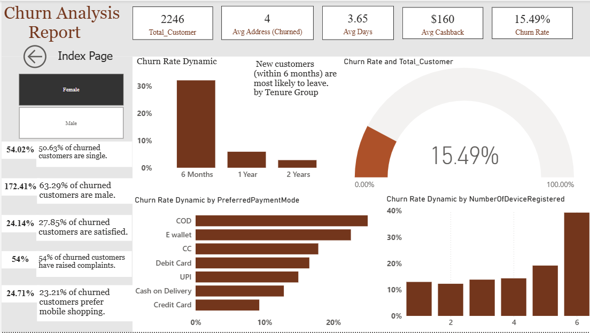

# 📊 Customer Churn Analysis – E-commerce



---

## 📌 Introduction

Customer churn refers to the situation when customers stop doing business with a company. It is a critical challenge for businesses as it directly impacts retention and long-term growth.

In the fast-paced e-commerce industry, retaining customers is essential. This project analyzes an online retail dataset to identify churn patterns and provide actionable insights. By understanding customer behavior, businesses can take proactive steps to reduce churn and improve customer loyalty.

---

## 🛠 Project Approach

* 📂 Dataset Source: Kaggle
* 🧹 Data Cleaning & Analysis: SQL
* 📊 Visualization: Power BI

### Project Stages:

1. Data Cleaning
2. Data Exploration
3. Insights Generation
4. Recommendations

---

## 🧹 Data Cleaning

### 1. Total Customers

```sql
SELECT DISTINCT COUNT(CustomerID) AS TotalNumberOfCustomers
FROM ecommercechurn;
```

✔ Total Customers: **5,630**

---

### 2. Duplicate Check

```sql
SELECT CustomerID, COUNT(CustomerID) AS Count
FROM ecommercechurn
GROUP BY CustomerID
HAVING COUNT(CustomerID) > 1;
```

✔ No duplicate records found

---

### 3. Null Value Check

```sql
SELECT 'Tenure' AS ColumnName, COUNT(*) FROM ecommercechurn WHERE Tenure IS NULL
UNION
SELECT 'WarehouseToHome', COUNT(*) FROM ecommercechurn WHERE WarehouseToHome IS NULL
UNION
SELECT 'HourSpendOnApp', COUNT(*) FROM ecommercechurn WHERE HourSpendOnApp IS NULL
UNION
SELECT 'OrderAmountHikeFromLastYear', COUNT(*) FROM ecommercechurn WHERE OrderAmountHikeFromLastYear IS NULL
UNION
SELECT 'CouponUsed', COUNT(*) FROM ecommercechurn WHERE CouponUsed IS NULL
UNION
SELECT 'OrderCount', COUNT(*) FROM ecommercechurn WHERE OrderCount IS NULL
UNION
SELECT 'DaySinceLastOrder', COUNT(*) FROM ecommercechurn WHERE DaySinceLastOrder IS NULL;
```

✔ Null values found in multiple columns

---

### 3.1 Handling Null Values

```sql
UPDATE ecommercechurn
SET HourSpendOnApp = (SELECT AVG(HourSpendOnApp) FROM ecommercechurn)
WHERE HourSpendOnApp IS NULL;

UPDATE ecommercechurn
SET Tenure = (SELECT AVG(Tenure) FROM ecommercechurn)
WHERE Tenure IS NULL;

UPDATE ecommercechurn
SET OrderAmountHikeFromLastYear = (SELECT AVG(OrderAmountHikeFromLastYear) FROM ecommercechurn)
WHERE OrderAmountHikeFromLastYear IS NULL;

UPDATE ecommercechurn
SET WarehouseToHome = (SELECT AVG(WarehouseToHome) FROM ecommercechurn)
WHERE WarehouseToHome IS NULL;

UPDATE ecommercechurn
SET CouponUsed = (SELECT AVG(CouponUsed) FROM ecommercechurn)
WHERE CouponUsed IS NULL;

UPDATE ecommercechurn
SET OrderCount = (SELECT AVG(OrderCount) FROM ecommercechurn)
WHERE OrderCount IS NULL;

UPDATE ecommercechurn
SET DaySinceLastOrder = (SELECT AVG(DaySinceLastOrder) FROM ecommercechurn)
WHERE DaySinceLastOrder IS NULL;
```

✔ All null values handled using mean imputation

---

### 4. Create CustomerStatus Column

```sql
ALTER TABLE ecommercechurn ADD CustomerStatus NVARCHAR(50);

UPDATE ecommercechurn
SET CustomerStatus =
CASE 
    WHEN Churn = 1 THEN 'Churned'
    WHEN Churn = 0 THEN 'Stayed'
END;
```

---

### 5. Create ComplainReceived Column

```sql
ALTER TABLE ecommercechurn ADD ComplainReceived NVARCHAR(10);

UPDATE ecommercechurn
SET ComplainReceived =
CASE 
    WHEN Complain = 1 THEN 'Yes'
    WHEN Complain = 0 THEN 'No'
END;
```

---

### 6. Data Standardization

#### Fix Login Device

```sql
UPDATE ecommercechurn
SET PreferredLoginDevice = 'Phone'
WHERE PreferredLoginDevice = 'Mobile Phone';
```

#### Fix Order Category

```sql
UPDATE ecommercechurn
SET PreferedOrderCat = 'Mobile Phone'
WHERE PreferedOrderCat = 'Mobile';
```

#### Fix Payment Mode

```sql
UPDATE ecommercechurn
SET PreferredPaymentMode = 'Cash on Delivery'
WHERE PreferredPaymentMode = 'COD';
```

#### Fix Outliers

```sql
UPDATE ecommercechurn SET WarehouseToHome = 27 WHERE WarehouseToHome = 127;
UPDATE ecommercechurn SET WarehouseToHome = 26 WHERE WarehouseToHome = 126;
```

---

## 🔍 Data Exploration

### 1. Churn Rate

```sql
SELECT 
COUNT(*) AS TotalCustomers,
SUM(Churn) AS ChurnedCustomers,
ROUND(SUM(Churn)*100.0/COUNT(*),2) AS ChurnRate
FROM ecommercechurn;
```

✔ Churn Rate: **16.84%**

---

### 2. Churn by Login Device

```sql
SELECT PreferredLoginDevice,
COUNT(*) AS Total,
SUM(Churn) AS Churned,
ROUND(SUM(Churn)*100.0/COUNT(*),2) AS ChurnRate
FROM ecommercechurn
GROUP BY PreferredLoginDevice;
```

---

### 3. Churn by City Tier

```sql
SELECT CityTier,
COUNT(*),
SUM(Churn),
ROUND(SUM(Churn)*100.0/COUNT(*),2)
FROM ecommercechurn
GROUP BY CityTier;
```

---

### 4. Warehouse Distance Impact

```sql
SELECT WarehouseToHome,
ROUND(SUM(Churn)*100.0/COUNT(*),2) AS ChurnRate
FROM ecommercechurn
GROUP BY WarehouseToHome;
```

---

### 5. Payment Mode Impact

```sql
SELECT PreferredPaymentMode,
ROUND(SUM(Churn)*100.0/COUNT(*),2) AS ChurnRate
FROM ecommercechurn
GROUP BY PreferredPaymentMode;
```

---

## 📊 Key Insights

* Churn rate is **16.84%**
* Computer users show higher churn
* Tier 1 cities have lower churn
* Closer warehouse distance → lower churn
* COD & E-wallet → higher churn
* Longer tenure → lower churn
* Complaints strongly linked to churn
* Coupons improve retention
* Higher cashback → better retention

---

## 🚀 Recommendations

* Improve UX for computer users
* Optimize logistics for distant customers
* Promote digital payment methods
* Strengthen customer support
* Use targeted offers for high-risk categories
* Improve multi-device experience
* Increase cashback incentives strategically

---

## 📈 Business Impact

* Improve retention
* Reduce churn
* Increase customer lifetime value
* Enable data-driven decisions

---

## 📊 Power BI Dashboard


